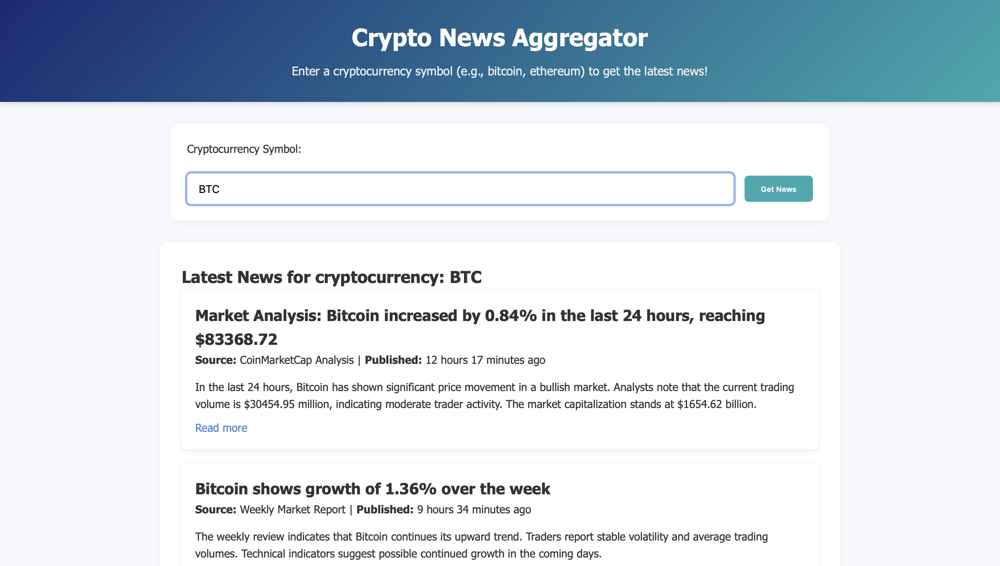
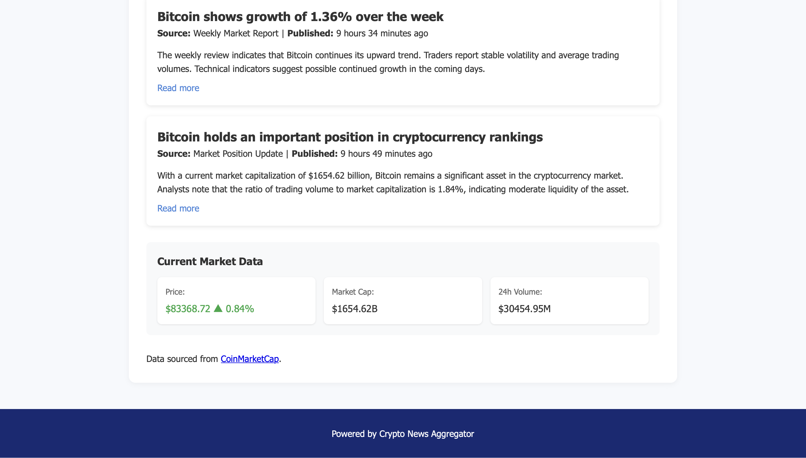

# blockchain
# Crypto News Service
# Title
This is a simple Rust-based web application that allows users to fetch the latest cryptocurrency news from multiple sources. It uses the CoinMarketCap API to retrieve information about various cryptocurrencies and displays relevant news articles for a given cryptocurrency name or symbol.

## Features:
- Search for cryptocurrency news by name or symbol
- Fetch data from the CoinMarketCap API
- Display news title, source, date, summary, and a link to the full article
- Basic HTML interface for user interaction

## Usage:

1. Clone this repository:
```bash
   git clone https://github.com/DayanaNur/blockchain.git


## Demo Screenshots:

Here are some screenshots showing how the website looks:




## Examples:

To search for cryptocurrency news, enter the cryptocurrency name or symbol (e.g., Bitcoin, BTC) in the search form on the homepage and click "Search."

Example:

Input: Bitcoin or BTC
Output: Latest news articles about Bitcoin will be displayed with the title, source, date, summary, and a link to the full article.


